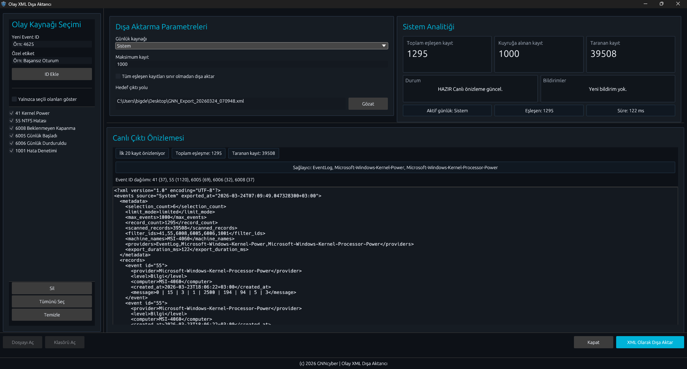

# Event XML Exporter

Windows Event Log kayıtlarını seçili Event ID filtreleriyle tarayıp XML olarak dışa aktaran Rust masaüstü aracı.



## Amaç

`System`, `Application` ve `Security` loglarını filtreleyip XML çıktısı üretmek.

## Teknoloji

- Rust
- `eframe` / `egui`
- `windows`
- `quick-xml`
- `rfd`

## Çalıştırma

```powershell
cargo run
```

## Derleme

```powershell
cargo build
```

Release:

```powershell
cargo build --release
```

## Çıktı

- Debug: `target\debug\event_xml_exporter_rust.exe`
- Release: `target\release\event_xml_exporter_rust.exe`

## Git / Release

- İlk temiz commit'ten sonra örnek tag: `v0.1.0`
- GitHub Release için release build çıktısı kullanılabilir
